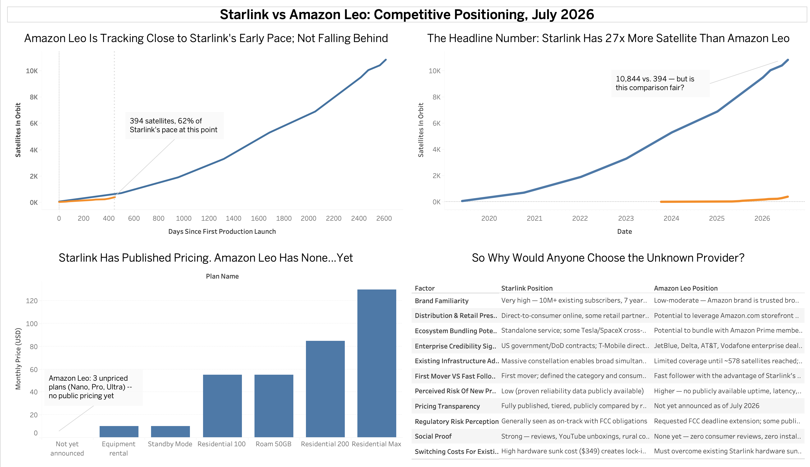
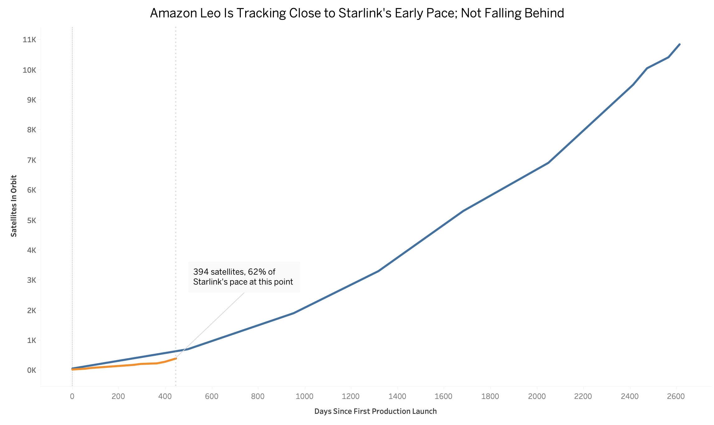
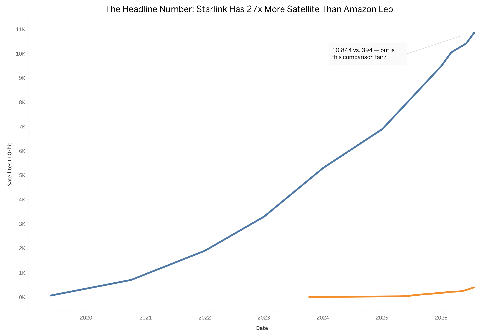
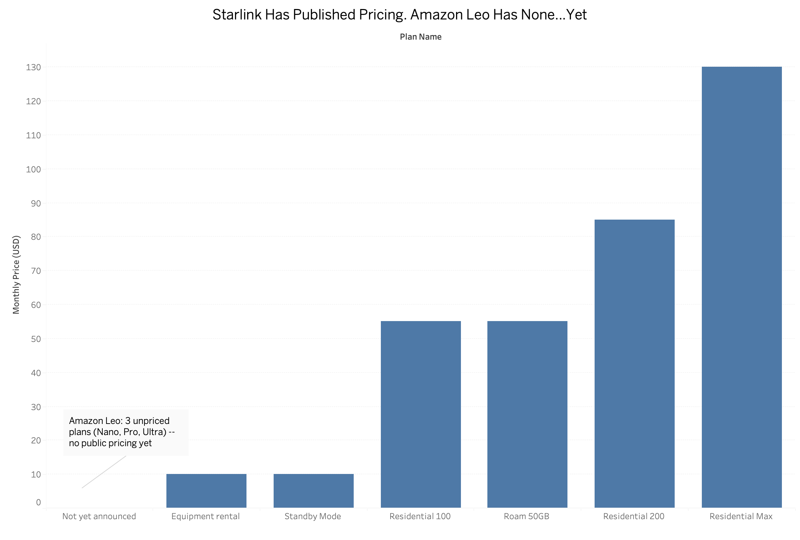
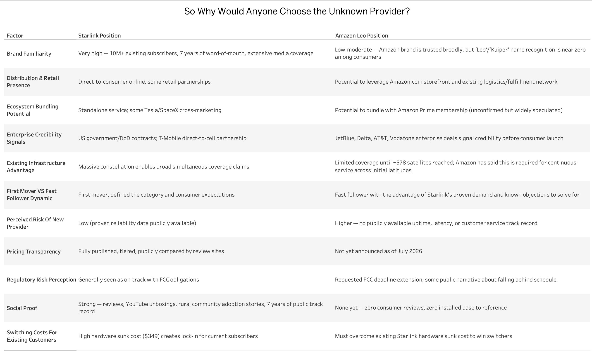

# Starlink vs. Amazon Leo: A Competitive Analysis

A data-driven competitive analysis of SpaceX's Starlink and Amazon's Leo
(used-to-be Project Kuiper) satellite internet constellations. 

**Data current as of: July 21, 2026**

## Why this project

I grew up hearing about fiber optics and networking from my dad, and space + satellites from my mom's side, so when Starlink and Amazon Leo both started making headlines this year, I couldn't help but dig in. Two of the most resourced companies on the planet are racing to build competing satellite internet networks, and the numbers alone are wild: Starlink has a 7-year head start and over 10 million subscribers, while Amazon Leo is leaning on Amazon's balance sheet, retail reach, and a regulatory deadline it's already about to miss. I wanted to actually run the numbers myself instead of just reading takes on it --- figure out what's true + exciting, and what each company is probably thinking about the other one right now (from a superficial standpoint).

## Dashboard



### Individual Views

**Deployment Velocity **


**Raw Deployment Gap**


**Pricing & Commercial Readiness**


**Consumer Decision Factors**


## What's in this repo

```
├── data/                          # Source CSVs (satellite counts, pricing, company facts, consumer factors)
├── sql/
│   ├── schema.sql                 # Table definitions
│   └── analysis_queries.sql       # All analysis queries (deployment velocity, pricing, etc.)
├── analysis/
│   ├── run_analysis.py            # Loads CSVs → SQLite, runs queries, generates charts
│   └── insights.md                # Written analysis and takeaways
├── charts/                        # Generated PNG charts
├── tableau/
│   ├── tableau_satellite_timeline.csv   # Flat export ready for Tableau
│   └── dashboard_guide.md         # Step-by-step Tableau build instructions
└── requirements.txt
```

## Quickstart (SQLite version — no server required)

```bash
pip install -r requirements.txt
python3 analysis/run_analysis.py
```

This rebuilds `data/warehouse.db` (SQLite), regenerates the charts in
`charts/`, and re-exports the Tableau-ready CSV in `tableau/`.


## The Numbers (July 2026)

| Metric | Starlink | Amazon Leo |
|---|---|---|
| Satellites in orbit | ~10,844 | ~394 |
| First production launch | May 24, 2019 | April 28, 2025 |
| Consumer service live? | Yes, since Oct 2020 | Not yet, enterprise only |
| Global subscribers | 10,000,000+ | 0, pre-commercial |
| Published pricing | $55–$130/mo | Not announced yet |
| Planned constellation size | ~12,000 | 7,727 |
| Regulatory status | On pace | Asked FCC for more time |

## So Why Would Anyone Pick the Company Nobody's Heard Of?

That's the real question this whole project is trying to answer. Amazon Leo isn't going to win by out-launching SpaceX, that race is already lost for now. Its real shot is everything else Amazon has that Starlink doesn't: Prime bundling, retail shelf space, and a growing stack of enterprise deals (JetBlue, Delta, AT&T) that build trust before a single consumer ever signs up. Full breakdown in `insights.md`.

## Where the Numbers Came From

Pulled from public satellite trackers (Jonathan McDowell's catalog, KeepTrack, Orbital Radar), FCC filings, and reporting from Light Reading, SatelliteInternet.com, and CableTV.com, all as of July 2026. Heads up: different trackers disagree by dozens to hundreds of satellites depending on when they last updated, especially for Amazon Leo since their numbers change almost weekly. Treat these as close estimates, not exact-to-the-satellite counts.

## Charts

- `charts/satellite_deployment_over_time.png` — raw deployment gap
- `charts/deployment_velocity_normalized.png` — apples-to-apples, both companies measured from their own day-zero
- `charts/starlink_pricing.png` — current published pricing tiers


## Pushing this to GitHub

This folder is already a git repo (see below). To push it to your own
GitHub account:

```bash
git remote add origin https://github.com/<your-username>/starlink-vs-amazonleo.git
git branch -M main
git push -u origin main
```
